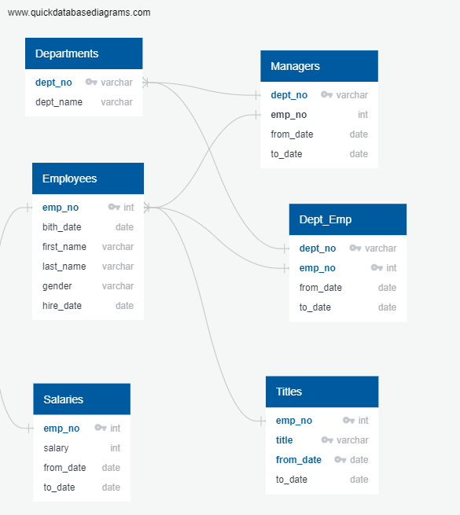

# Pewlett-Hackard-Analysis: Technical Report

The analysis for Pewlett-Hackard was completed in several parts, using the main criteria of employee retirement eligibility dates between Jan 1, 1952 - Dec 31, 1955 and hire dates between Jan 1, 1985 - Dec 31, 1988. The company wanted to prepare information of those that were soon retiring, and also information in order to create a mentorship program to have some of those retirees come back and help train new hires. We were given 6 csv files to work with for this project.

## ERD
In this project, we used Entity Relationship Diagrams to form relationships between the data-sets. 
  

## Process- Queries
In our first query, we took eligible retirees (birth dates between Jan 1, 1952 - Dec 31, 1955 and hire dates between Jan 1, 1985 - Dec 31, 1988) and joined this to our Titles.csv file. I used the count function to find out how many titles would be retiring. 

To get the Number of Employees with each title, I used two inner joins from the Employees.csv file (Titles and Dept_emp) and added the to_date with a much future year to make sure they are currently employed. 
  

To find out the current list of employees born between 01/01/52- 12/31/55, I used the Employees.csv file and did three inner joins (Titles, Salaries, and Dept_emp), categorizing it with specific born dates and setting a to_date as a future year to make sure they were currently employed. In total, there were 112,049 employees born between those dates. As employees had transitions/role changes during their tenure, I made sure to check for their most recent role and get rid of any duplicates.

## Mentorship Eligibility
Mentorship Eligibility required employees to be currently employed, and birth dates between Jan- Dec of 1965. Using the Employee.csv file, I used two inner joins (Titles and dept_emp) with the criteria eligbility requirements and checked for duplicates. The number originally was 2,382 and after getting rid of duplicates, it was 1,549.  
 
## Challenges, Conclusion
It was challenging to make sure the data being used was filtered in the correct way and was telling the story you wanted it to tell. Depending on certail csv files, one key could mean an entirely different thing than another file key, although they have the same key name. Another difficulty was making sure that the most recent titles were being used, rather than all the positions that employees had during their employment. Pewlett Hackard has some great information here! I would suggest looking more into the salaries per department and see how that has changed over the last few years in case they want to think about salary raises. Also, they could look into turnover calculations and how employees are changing departments within the company.
